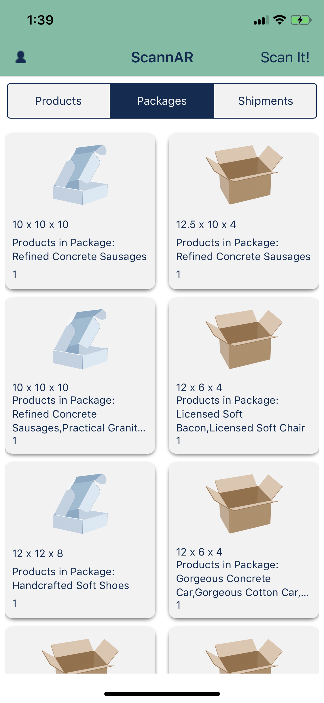
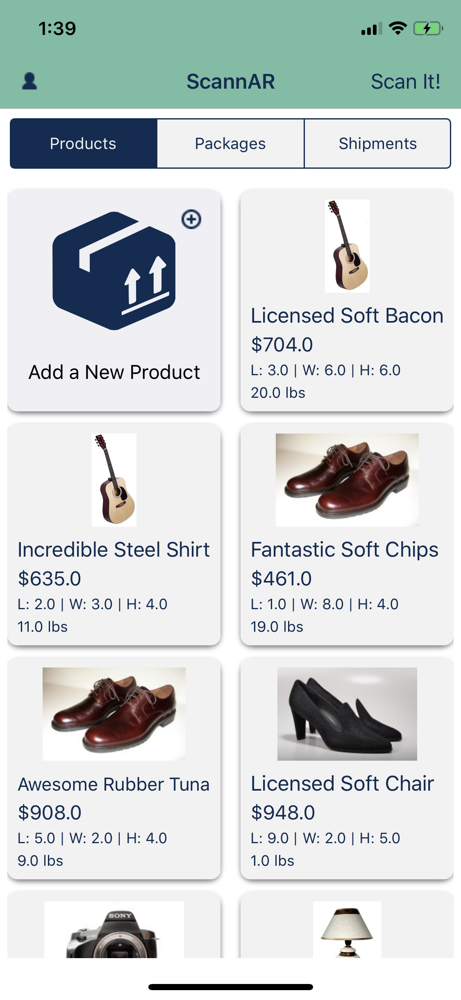

# ScannAR (iOS) a.k.a. labs11-package-size-iOS 
> iOS app for Lambda Labs 11 - Package Size Project - ARKit-enabled iOS app designed for 3rd-party resellers

[![Swift Version][swift-image]][swift-url]
[![License][license-image]][license-url]

## Features

- [1] Scan products that you'd like to sell with AR
- [2] Get recommmended box sizes for your products based on that scan
- [3] Add shipping information to your products
- [4] Tracking your products from pickup to delivery

## Requirements

- iOS 11.0+

## Installation

#### Coming Soon

## Meta

Distributed under the MIT license. See ``LICENSE`` for more information.

[swift-image]:https://img.shields.io/badge/swift-5.0-orange.svg
[swift-url]: https://swift.org/
[license-image]: https://img.shields.io/badge/License-MIT-blue.svg
[license-url]: LICENSE
